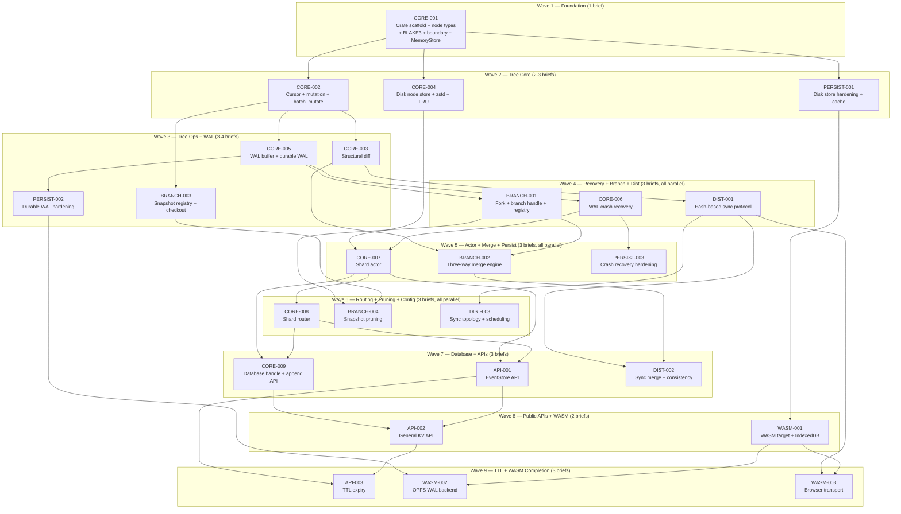

# Haematite — Dispatch Waves

All 25 briefs across 6 clusters, organized into dependency-ordered waves.
Briefs within a wave can run in parallel. File-conflict notes where relevant.

New greenfield repo — no pre-existing code, so structural conflicts between
parallel briefs are limited to shared module roots (mod.rs, lib.rs, Cargo.toml).

## Wave Diagram

## Wave Details

### Wave 1 — Foundation (1 brief)

The single root dependency. Everything else depends on this.

| Brief | Cluster | Title | R#s | Key Files Created |
|-------|---------|-------|-----|-------------------|
| CORE-001 | core | Crate scaffold, node types, BLAKE3, boundary, MemoryStore | 8 | Cargo.toml, lib.rs, tree/node.rs, tree/boundary.rs, store/memory.rs |

**Estimated compile time:** Fast — new crate, only blake3 + zstd deps. ~10s clean build.

### Wave 2 — Tree Core (3 briefs)

All depend only on CORE-001.

| Brief | Cluster | Title | R#s | Key Files Created |
|-------|---------|-------|-----|-------------------|
| CORE-002 | core | Cursor + mutation + batch_mutate | 8 | tree/cursor.rs, tree/mutate.rs |
| CORE-004 | core | Disk node store + zstd + LRU cache | 6 | store/disk.rs |
| PERSIST-001 | persistence | Disk store hardening + cache policies | 7 | store/disk.rs enhancements |

**File conflict:** CORE-004 and PERSIST-001 both touch store/disk.rs. CORE-004 creates it, PERSIST-001 modifies it. **Land CORE-004 first, then PERSIST-001.** Or stagger: dispatch CORE-002 + CORE-004 together, then PERSIST-001 after CORE-004 lands.

**Recommended sub-wave:**
- 2a: CORE-002 + CORE-004 (no conflicts)
- 2b: PERSIST-001 (after CORE-004 lands)

### Wave 3 — Tree Operations + WAL (4 briefs)

| Brief | Cluster | Title | R#s | Depends On |
|-------|---------|-------|-----|------------|
| CORE-003 | core | Structural diff | 7 | CORE-002 |
| CORE-005 | core | WAL buffer + durable WAL writer | 7 | CORE-002 |
| BRANCH-003 | branching | Snapshot registry + time-travel checkout | 5 | CORE-002 |
| PERSIST-002 | persistence | Durable WAL hardening | 5 | CORE-005 |

**File conflict:** CORE-005 creates wal/buffer.rs and wal/durable.rs. PERSIST-002 modifies wal/durable.rs. **Land CORE-005 before PERSIST-002.**

**Recommended sub-wave:**
- 3a: CORE-003 + CORE-005 + BRANCH-003 (no conflicts)
- 3b: PERSIST-002 (after CORE-005 lands)

### Wave 4 — Recovery + Branch + Distribution (3 briefs, all parallel)

| Brief | Cluster | Title | R#s | Depends On |
|-------|---------|-------|-----|------------|
| CORE-006 | core | WAL crash recovery | 5 | CORE-005 |
| BRANCH-001 | branching | Fork + branch handle + registry | 6 | CORE-001, CORE-002, CORE-005 |
| DIST-001 | distribution | Hash-based sync protocol | 7 | CORE-001, CORE-003 |

No file conflicts. All three can run in parallel.

### Wave 5 — Shard Actor + Merge + Persistence (3 briefs, all parallel)

| Brief | Cluster | Title | R#s | Depends On |
|-------|---------|-------|-----|------------|
| CORE-007 | core | Shard actor (beamr process) | 7 | CORE-004, CORE-005, CORE-006 |
| BRANCH-002 | branching | Three-way merge + conflict resolution | 7 | BRANCH-001, CORE-003 |
| PERSIST-003 | persistence | Crash recovery hardening | 5 | PERSIST-001, PERSIST-002 |

No file conflicts. All three can run in parallel.

### Wave 6 — Routing + Pruning + Sync Config (3 briefs, all parallel)

| Brief | Cluster | Title | R#s | Depends On |
|-------|---------|-------|-----|------------|
| CORE-008 | core | Shard router (hash-based routing) | 5 | CORE-007 |
| BRANCH-004 | branching | Snapshot pruning + node reclamation | 3 | BRANCH-003, BRANCH-001 |
| DIST-003 | distribution | Sync topology + scheduling | 3 | DIST-001 |

No file conflicts. All three can run in parallel.

### Wave 7 — Database Handle + APIs (3 briefs)

| Brief | Cluster | Title | R#s | Depends On |
|-------|---------|-------|-----|------------|
| CORE-009 | core | Database handle + append API | 9 | CORE-007, CORE-008 |
| API-001 | api | EventStore API + types | 7 | CORE-007, CORE-008 |
| DIST-002 | distribution | Sync merge + consistency modes | 5 | DIST-001, BRANCH-002 |

CORE-009 and API-001 both depend on CORE-007/008 and modify the public API surface. CORE-009 creates db.rs, API-001 creates api/ module. **No direct file conflict — can run in parallel.**

### Wave 8 — Public APIs + WASM (2 briefs, all parallel)

| Brief | Cluster | Title | R#s | Depends On |
|-------|---------|-------|-----|------------|
| API-002 | api | General KV API | 5 | CORE-009, API-001 |
| WASM-001 | wasm | WASM build target + IndexedDB store | 7 | CORE-001, PERSIST-001 |

No file conflicts.

### Wave 9 — TTL + WASM Completion (3 briefs, all parallel)

| Brief | Cluster | Title | R#s | Depends On |
|-------|---------|-------|-----|------------|
| API-003 | api | TTL expiry with sweep actors | 5 | API-001, API-002 |
| WASM-002 | wasm | OPFS WAL backend + fallback | 4 | WASM-001, PERSIST-002 |
| WASM-003 | wasm | Browser transport for sync | 2 | WASM-001, DIST-001 |

No file conflicts. All three can run in parallel.

## Summary

| Wave | Briefs | Parallelism | Blockers | Notes |
|------|--------|-------------|----------|-------|
| 1 | 1 | Sequential | None | Foundation — must land first |
| 2 | 3 | 2a: CORE-002+004, then 2b: PERSIST-001 | CORE-001 | store/disk.rs conflict |
| 3 | 4 | 3a: CORE-003+005+BRANCH-003, then 3b: PERSIST-002 | CORE-002 | wal/durable.rs conflict |
| 4 | 3 | All parallel | CORE-005, CORE-003 | No conflicts |
| 5 | 3 | All parallel | Wave 4 items | No conflicts |
| 6 | 3 | All parallel | CORE-007 | No conflicts |
| 7 | 3 | All parallel | CORE-007+008 | No conflicts |
| 8 | 2 | All parallel | CORE-009, PERSIST-001 | No conflicts |
| 9 | 3 | All parallel | API-001+002, WASM-001 | No conflicts |

**Total: 25 briefs, 9 waves, max concurrency 3-4 per wave.**

**Aggressive dispatch schedule (8 slots):**
- Dispatch 1: CORE-001 (solo, must land first)
- Dispatch 2: CORE-002 + CORE-004 (parallel)
- Dispatch 3: CORE-003 + CORE-005 + BRANCH-003 + PERSIST-001 (parallel)
- Dispatch 4: CORE-006 + BRANCH-001 + DIST-001 + PERSIST-002 (parallel)
- Dispatch 5: CORE-007 + BRANCH-002 + PERSIST-003 (parallel)
- Dispatch 6: CORE-008 + BRANCH-004 + DIST-003 (parallel)
- Dispatch 7: CORE-009 + API-001 + DIST-002 (parallel)
- Dispatch 8: API-002 + WASM-001 (parallel)
- Dispatch 9: API-003 + WASM-002 + WASM-003 (parallel)

**Compile time estimate:** Greenfield Rust crate with blake3 + zstd + beamr. Clean build ~15-20s, incremental ~3-5s. Fast generations — Drosophila territory.
